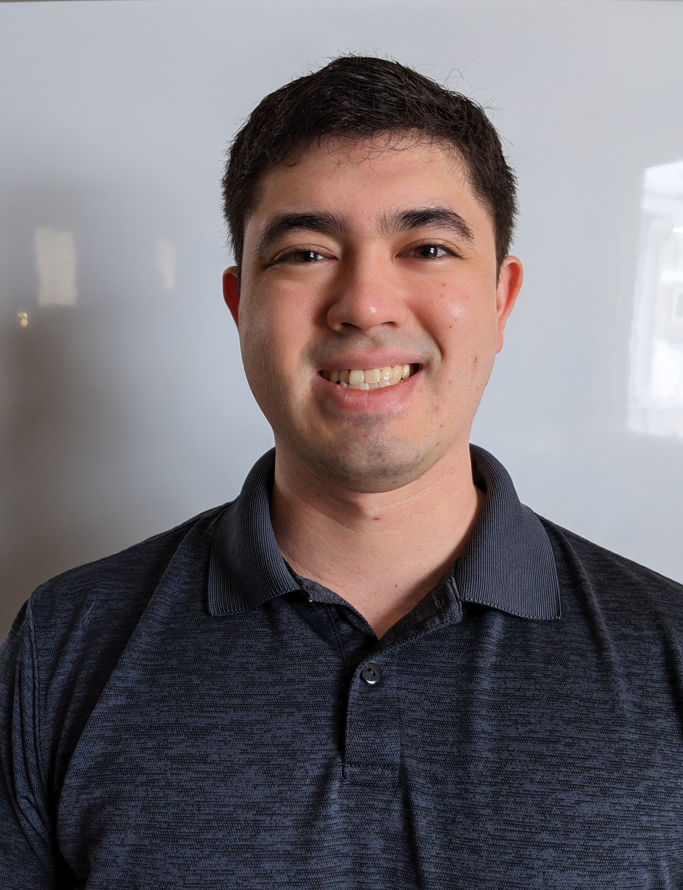

Hi! I'm Sam Reiswig, currently I work as a Cybersecurity Analyst.  
In the past I've been a Quality Assurance Analyst, Software Development Engineer in Test, Software Engineer working on Factory Test Equipment, and Web Dev.  
In the Future who knows what I'll be.  

The goal with this blog is to document projects that I work on in my spare time.  
The main focus will be Software Projects and ML topics but I don't like to be pigeonholed.  
Any topic is fair game!  

Enjoy!
